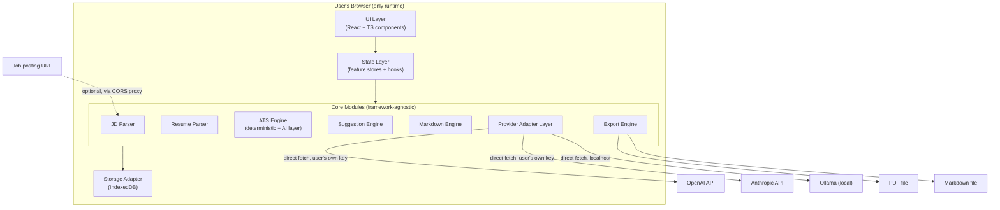

# Architecture

**Status:** Draft v1 · **Last updated:** 2026-07-15

Governing decisions: [ADR-001](decisions/ADR-001.md) (standalone, backend-optional), [ADR-002](decisions/ADR-002.md) (local-first persistence), [ADR-003](decisions/ADR-003.md) (client-side BYOM providers), [ADR-004](decisions/ADR-004.md) (hybrid ATS engine), [ADR-005](decisions/ADR-005.md) (TypeScript).

## 1. System overview

Editable diagram: [diagrams/architecture.excalidraw](diagrams/architecture.excalidraw) (open at [excalidraw.com](https://excalidraw.com) → File → Open, or the Excalidraw VS Code extension).

Everything runs in the user's browser. There is no application server. The only network calls the app makes are: (a) directly to the AI provider the user configured, using credentials they supplied, and (b) optionally fetching a JD URL through a CORS-proxy for scraping (unchanged from v0.1, see [features/jd-parser.md](features/jd-parser.md)).



No component in `Core` imports React. UI components call into Core through the State Layer only — this is what makes Core independently testable and what a future non-browser context (e.g., a CLI or a self-hosted sync backend, both explicitly out of v1 scope) could reuse.

## 2. User journey

```mermaid
flowchart LR
    A["1. Import JD\n(paste / URL / scrape)"] --> B["2. Configure AI provider\n(optional)"]
    B --> C["3. Import resume\n(PDF / MD / paste)"]
    C --> D["4. ATS analysis\n(deterministic + AI)"]
    D --> E["5. Review suggestions\n(accept/reject/refine)"]
    E --> F["6. Live re-score"]
    F -->|more gaps to close| E
    F --> G["7. Preview\n(Markdown, diff, versions)"]
    G --> H["8. Export\n(Markdown / PDF)"]
```



Step 2 is explicitly optional and can happen at any point, including never — Steps 1, 3, 4 (deterministic only), 7, and 8 all function with no AI provider configured, per [ADR-004](decisions/ADR-004.md).

## 3. Domain model and data schema

Two documents are the source of truth for everything downstream: the **Resume JSON** and the **JD JSON**. Both are versioned schemas (a `schemaVersion` field ships in every persisted record so future migrations are detectable).

### 3.1 Resume JSON

```ts
interface Resume {
  id: string;                // uuid
  schemaVersion: 1;
  meta: {
    name: string;
    title?: string;
    contact: { email?: string; phone?: string; location?: string; links?: Link[] };
  };
  sections: ResumeSection[]; // ordered — order is meaningful and preserved on export
  markdownSource: string;    // canonical rendering — see markdown-engine.md
  createdAt: string;         // ISO 8601
  updatedAt: string;
}

interface ResumeSection {
  id: string;
  type: "summary" | "experience" | "projects" | "education"
      | "skills" | "certifications" | "achievements" | "custom";
  title: string;              // as displayed, e.g. "Professional Experience"
  entries: ResumeEntry[];
}

interface ResumeEntry {
  id: string;
  heading?: string;           // e.g. "Senior Engineer, Acme Corp"
  subheading?: string;        // e.g. "Jan 2022 – Present"
  bullets: Bullet[];
  tags?: string[];             // free-form, e.g. skills list entries
}

interface Bullet {
  id: string;
  text: string;
  origin: "user" | "ai-suggested" | "ai-accepted"; // audit trail, see §7
}
```

### 3.2 JD JSON

```ts
interface JobDescription {
  id: string;
  schemaVersion: 1;
  source: { type: "paste" | "url"; url?: string; scrapedAt?: string };
  rawText: string;
  language: string;            // BCP-47, detected
  structured: {
    company?: string;
    role?: string;
    sections: JDSection[];     // Requirements / Responsibilities / Preferred / etc.
  };
  keywords: Keyword[];         // output of the ATS engine's extraction pass
  createdAt: string;
}

interface JDSection {
  label: string;               // normalized: "requirements" | "responsibilities" | "preferred" | "about" | "other"
  weight: number;               // 0–2×, see ats-engine.md
  text: string;
}

interface Keyword {
  term: string;
  category: "language" | "framework" | "database" | "cloud" | "tool" | "methodology" | "general";
  frequency: number;
  weight: number;               // frequency × section weight × bigram multiplier
}
```

### 3.3 Suggestion and audit trail

```ts
interface Suggestion {
  id: string;
  resumeEntryId: string;        // Bullet.id or ResumeEntry.id it targets
  kind: "rewrite" | "keyword-injection" | "verb-upgrade" | "section-add";
  original: string;
  proposed: string;
  reason: string;               // shown to the user, always populated
  source: "deterministic" | "ai";
  status: "pending" | "accepted" | "rejected";
  createdAt: string;
  resolvedAt?: string;
}
```

### 3.4 Version history

Every accepted suggestion (and every manual edit) produces a `ResumeVersion` snapshot — an append-only log, not a mutation of history. This is what powers the diff viewer and score-progression chart in [features/resume-editor.md](features/resume-editor.md).

```ts
interface ResumeVersion {
  id: string;
  resumeId: string;
  snapshot: Resume;             // full snapshot, not a diff — see §8 for rationale
  atsScore: AtsScoreResult;     // score at this point in history
  triggeredBy: { type: "suggestion"; suggestionId: string } | { type: "manual-edit" };
  createdAt: string;
}
```

## 4. Component breakdown

```
src/
├── core/                     # framework-agnostic, no React import allowed
│   ├── jd/                   # parse, scrape, section-detect  → jd-parser.md
│   ├── resume/                # parse (PDF/MD/text), section-detect → resume-import.md
│   ├── ats/                   # deterministic engine + AI layer orchestration → ats-engine.md
│   ├── suggestions/            # suggestion generation + accept/reject state transitions
│   ├── markdown/               # Resume JSON ⇄ Markdown, rendering → markdown-engine.md
│   ├── export/                 # Markdown/PDF exporters, plugin registry → export-engine.md
│   ├── providers/               # ProviderAdapter interface + OpenAI/Anthropic/Ollama impls → ai-provider.md
│   └── storage/                 # StorageAdapter interface + IndexedDB impl
├── state/                    # feature-scoped stores/hooks; only layer allowed to call core/*
├── components/                # presentational + connected React components
└── app/                       # routing/shell, thin
```

Rule: `components/` may import `state/`, never `core/*` directly. `state/` may import `core/*`. `core/*` modules may not import each other's private internals — only published interfaces (e.g., `ats/` consumes `providers/` through `ProviderAdapter`, never reaches into a specific provider implementation).

## 5. AI provider abstraction

Full spec: [features/ai-provider.md](features/ai-provider.md). Summary: a single `ProviderAdapter` interface (see [ADR-003](decisions/ADR-003.md)) that every provider — hosted or local — implements, covering request/response normalization, streaming, token usage, cost estimation, and a common error taxonomy (auth failure, rate limit, timeout, model-not-found, content-filtered). The ATS AI layer and Suggestion engine depend only on this interface, never on a concrete provider.

## 6. ATS engine

Full spec: [features/ats-engine.md](features/ats-engine.md). Summary per [ADR-004](decisions/ADR-004.md): a deterministic core (finishes the tokenizer/section-weighting/categorization work already designed in [DEVELOPMENT_PLAN.md](../DEVELOPMENT_PLAN.md)) produces a reproducible score with per-deduction explanations at zero cost; an optional AI layer adds semantic checks (relevance, phrasing strength, substantiation) when a provider is configured, always presented as a distinct, attributed layer (`source: "ai"` on every `Suggestion`).

## 7. Markdown pipeline

`markdownSource` on `Resume` is the canonical, git-diffable representation. The structured `sections`/`entries`/`bullets` tree is derived from it and is what the editor and suggestion engine operate on; edits to either are kept in sync by the markdown engine (structured edit → re-render Markdown; direct Markdown edit → re-parse into structure). Full spec: [features/markdown-engine.md](features/markdown-engine.md).

## 8. Export pipeline

Export targets are plugins implementing a common `Exporter` interface (`Resume → Blob`), registered at startup. v1 ships `MarkdownExporter` and `PdfExporter` (PDF generated client-side from the rendered Markdown via a headless-print/HTML-to-PDF approach — see [features/export-engine.md](features/export-engine.md) for the library evaluation). DOCX/LaTeX/templates are future `Exporter` implementations, not architecture changes.

## 9. Frontend state management

Given no backend and no cross-tab sync requirement in v1, state management stays intentionally boring: React Context + hooks per feature domain (`useResume`, `useJobDescription`, `useAtsScore`, `useSuggestions`, `useProviderConfig`), each backed by the relevant `core/` module and persisted through `storage/`. No global store library (Redux/Zustand/etc.) is adopted for v1 — the domains are cleanly separable and a global store would add indirection without solving a problem that exists yet. Revisit only if cross-domain derived state (e.g., live re-score reacting to both resume and JD changes) becomes unwieldy through plain context — that reactive link is exactly why `useAtsScore` is its own hook that subscribes to both `useResume` and `useJobDescription` rather than owning state itself.

## 10. "Database design"

There is no server-side database in v1 ([ADR-002](decisions/ADR-002.md)). The relevant design is the **IndexedDB schema**:

| Object store | Key | Notes |
|---|---|---|
| `resumes` | `Resume.id` | current working resume(s) |
| `resumeVersions` | `ResumeVersion.id`, indexed by `resumeId` | append-only |
| `jobDescriptions` | `JobDescription.id` | one per imported JD, supports future multi-JD comparison |
| `suggestions` | `Suggestion.id`, indexed by `resumeEntryId` | |
| `providerConfigs` | `provider name` | encrypted credentials, see §11 |
| `settings` | singleton | feature flags, UI preferences |

All access goes through the `StorageAdapter` interface in `core/storage/`, never raw `indexedDB` calls from feature code — this is the seam [ADR-002](decisions/ADR-002.md) leaves open for an optional future sync backend.

## 11. Security and privacy considerations

- **API keys live in IndexedDB, encrypted at rest** with a key derived (PBKDF2/WebCrypto) from a passphrase the user sets on first provider setup. This raises the bar above plaintext localStorage but does **not** protect against a compromised browser session or malicious extension with page access — that limitation must be stated in-product, not just in docs, per [ADR-003](decisions/ADR-003.md).
- **No telemetry, no analytics, no error reporting to a third-party service by default.** If this is ever added (e.g., opt-in crash reporting), it must ship off by default and be called out in `docs/features/` with its own spec — silent telemetry directly violates [vision.md](vision.md)'s privacy-first principle.
- **JD URL scraping goes through a public CORS proxy** (unchanged from v0.1) — this is a third party seeing the JD URL (not the resume). Users pasting private/authenticated job posting URLs should be warned in-product, as the current README already does.
- **Resume/JD content is never sent anywhere except a provider the user explicitly configured**, and only when an AI-layer action is invoked, not on every keystroke.
- **Export files (PDF/Markdown) are generated and downloaded client-side**; no server ever sees them.

## 12. Risk analysis and trade-offs

| Risk | Impact | Mitigation |
|---|---|---|
| Browser-stored API keys are extractable by anyone with local device/devtools access | Credential leak if device is compromised | Encrypt at rest, disclose trust model explicitly in UI, never treat as a solved problem |
| A provider changes/deprecates its API shape | AI layer breaks for that provider | Adapter isolation means blast radius is one adapter, not core logic; adapters should be independently versioned/tested |
| CORS proxy for JD scraping is a single point of failure (already true in v0.1) | Scraping fails, degrades to manual paste | Documented fallback already exists; two-proxy fallback was already designed in [DEVELOPMENT_PLAN.md](../DEVELOPMENT_PLAN.md) §3.1 and should carry over |
| Client-side PDF parsing (pdf.js or similar) mis-extracts complex resume layouts (multi-column, tables, text-in-images) | Bad Resume JSON, bad downstream scoring | Always show the parsed result for user confirmation/edit before proceeding — never trust extraction silently; see [features/resume-import.md](features/resume-import.md) |
| No server-side backup — user clears browser storage without exporting | Data loss | UI should nudge export at meaningful checkpoints; this is a product/UX requirement, not just infra |
| Deterministic ATS engine gives false confidence ("91% means I'll pass") | User over-trusts an estimate | Score must always be framed as a relative/coverage estimate, not a guarantee — carry over the existing README's disclaimer language into the product UI itself, not just docs |
| TypeScript migration ([ADR-005](decisions/ADR-005.md)) done incrementally alongside a rearchitecture | Mixed JS/TS churn risk during transition | Migrate module-by-module as each is rebuilt for the new architecture anyway — no separate migration PR |

## 13. Open questions and assumptions

These need answers before or during implementation of the relevant feature; flagged here rather than silently assumed.

1. **PDF parsing library** — `pdf.js` is the likely default (mature, client-side, no server), but layout/heading detection quality needs a spike against a handful of real-world resume templates before committing. See [features/resume-import.md](features/resume-import.md).
2. **PDF export rendering approach** — client-side HTML→PDF (e.g., browser print-to-PDF via a hidden iframe, or a library like `pdf-lib`/`react-pdf`) needs a decision that balances fidelity (fonts, exact ATS-safe layout) against bundle size. See [features/export-engine.md](features/export-engine.md).
3. **Passphrase UX for credential encryption** — is a mandatory passphrase (extra friction, better security) or an optional one with a plaintext fallback (worse security, matches "no signup" ease) the right default? Affects first-run UX materially.
4. **Multi-resume / multi-JD scope for v1** — the schema (§3) already supports multiple `Resume`/`JobDescription` records, but whether the v1 *UI* exposes multi-JD comparison (v0.1 F-13, listed as future in the new vision) or stays single-active-document needs an explicit MVP scope call — see [ROADMAP.md](../ROADMAP.md).
5. **AI layer cost/latency disclosure** — vision asks for "estimated cost, latency monitoring" (Step 2). Needs a decision on whether this is a per-call estimate shown before the user confirms an AI action (safer, adds a click) or a running total shown passively (lower friction, easier to blow past without noticing).
6. **Section/heading detection heuristics** for both JD and resume parsing are regex/keyword-based in v0.1 and carried forward as the deterministic baseline — should non-English resumes/JDs be in v1 scope given "detect language" is called out in Step 1, or explicitly deferred (current heuristics are English-pattern-specific)?
