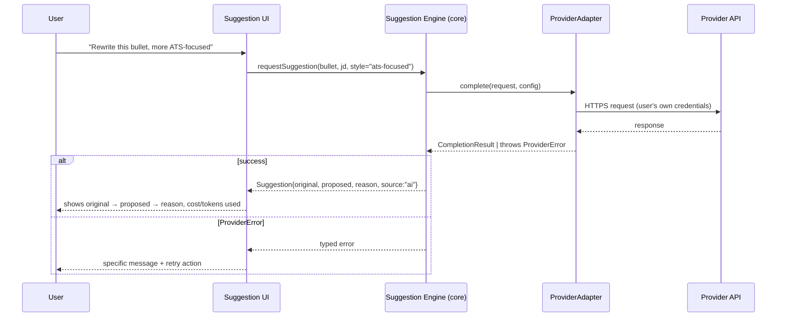

# Feature: AI Provider Abstraction (BYOM)

**Status:** Draft v1 · **Related:** [ADR-003](../decisions/ADR-003.md), [architecture.md §5](../architecture.md#5-ai-provider-abstraction)

## Problem statement

The tool must never force a user onto a specific AI vendor, must work at zero cost with no provider at all, and must let technically-capable users run local models. It must also not become a maintenance burden where every new provider requires touching core scoring/suggestion logic. The v0.1 prototype has no AI integration at all, so this is new surface, not a fix.

## User stories

- As a user, I can add my OpenAI or Anthropic API key so the tool can generate resume suggestions, without that key ever leaving my browser except to call that provider directly.
- As a user with no API key and no interest in paying for one, I can use the entire scoring and export flow with zero AI configured.
- As a privacy-conscious user, I can point the tool at my local Ollama instance instead of any cloud provider.
- As a contributor, I can add support for a new provider by writing one adapter file against a documented interface, without modifying the ATS engine or suggestion engine.
- As a user, after any AI action I can see exactly how many tokens it used and roughly what it cost.
- As a user, if a provider call fails (bad key, rate limit, timeout, model unavailable), I get a specific error telling me what happened and what to do — not a spinner that never resolves.

## Functional requirements

See [requirements.md § FR-PROV](../requirements.md#ai-provider-configuration-fr-prov-featuresai-providermd) for the authoritative, traceable list.

## Non-functional requirements

- Credentials encrypted at rest (NFR-3).
- No provider call happens without an explicit user-triggered action — no background/automatic calls.
- Adapter interface is stable enough that adding a provider is additive (new file), not a breaking change to existing adapters (NFR-7).

## API contract: `ProviderAdapter`

```ts
interface ProviderAdapter {
  readonly id: string;                 // "openai" | "anthropic" | "ollama" | ...
  readonly displayName: string;
  readonly requiresApiKey: boolean;

  listModels(config: ProviderConfig): Promise<ModelInfo[]>;

  complete(request: CompletionRequest, config: ProviderConfig): Promise<CompletionResult>;

  estimateCost(request: CompletionRequest, config: ProviderConfig): CostEstimate;
}

interface ProviderConfig {
  providerId: string;
  apiKey?: string;        // absent for Ollama
  baseUrl?: string;        // override for self-hosted/compatible endpoints
  defaultModel: string;
}

interface CompletionRequest {
  systemPrompt: string;
  userPrompt: string;
  model: string;
  maxTokens?: number;
  temperature?: number;
}

interface CompletionResult {
  text: string;
  usage: { promptTokens: number; completionTokens: number };
  latencyMs: number;
  model: string;
  raw?: unknown;           // provider's raw response, for debugging only — never parsed by callers
}

interface CostEstimate {
  estimatedUsd: number | null;   // null when the provider has no known pricing (e.g. local models)
  basis: string;                  // human-readable, e.g. "$0.15/1K tokens (gpt-4o-mini, est.)"
}

type ProviderError =
  | { kind: "auth"; message: string }
  | { kind: "rate_limit"; message: string; retryAfterMs?: number }
  | { kind: "timeout"; message: string }
  | { kind: "model_not_found"; message: string }
  | { kind: "content_filtered"; message: string }
  | { kind: "network"; message: string }
  | { kind: "unknown"; message: string; raw?: unknown };
```

Every adapter throws a typed `ProviderError`, never a raw fetch/SDK exception — callers (the ATS AI layer, the suggestion engine) branch on `kind`, not on provider-specific error shapes.

## UI flow

```
Settings → AI Providers
  ├─ [+ Add provider] → select OpenAI | Anthropic | Ollama
  │     → OpenAI/Anthropic: enter API key, pick default model, [Test connection]
  │     → Ollama: enter base URL (default http://localhost:11434), [Fetch available models]
  ├─ Configured providers list: name, default model, [Set as default] [Remove]
  └─ (first time only) passphrase prompt to encrypt stored credentials — see architecture.md open question 3
```

A provider must pass "Test connection" (one cheap `listModels` or minimal `complete` call) before it's usable elsewhere in the app — surfaces auth/network problems at setup time, not mid-suggestion.

## Sequence diagram — generating a suggestion



## Acceptance criteria

- **Given** no provider is configured, **when** the user opens the AI-suggestion panel, **then** they see an explanation and a link to add a provider, and every other app feature (import, score, export) remains fully usable.
- **Given** a valid OpenAI key is configured, **when** the user requests a suggestion, **then** the response includes token usage and a cost estimate before the suggestion is presented as final.
- **Given** an invalid API key, **when** the user requests a suggestion, **then** the error explicitly says authentication failed and links to where they can fix the key — not a generic "something went wrong."
- **Given** Ollama is configured and the local server is unreachable, **when** the user requests a suggestion, **then** the error identifies it as a network/connection issue to `baseUrl`, not an auth issue.
- **Given** a provider call exceeds the configured timeout, **when** waiting, **then** the UI shows a timeout error and the request is abandoned — never an indefinite spinner (NFR-8).

## Edge cases

- User configures a provider, generates suggestions, then removes the provider — previously generated `Suggestion` records must remain viewable (they're already persisted data, not live provider state).
- Model list fetch succeeds but returns zero models (e.g., misconfigured Ollama with no models pulled) — UI must state this specifically, not show an empty dropdown with no explanation.
- API key encrypted with a passphrase the user then forgets — needs an explicit "remove and re-add" recovery path since there is no backend to reset it.
- Provider returns a response but flags content filtering (e.g., resume content trips a safety filter) — must map to `content_filtered`, not `unknown`, so the UI can explain rather than show a raw error.
- Extremely long resume/JD pushes a request over a model's context window — adapter must catch and surface this distinctly rather than letting the provider's generic 400 error pass through unexplained.

## Future enhancements

- Additional adapters: Gemini, Groq, OpenRouter, LM Studio, generic OpenAI-compatible endpoint (FR-PROV-7).
- Model comparison view (same prompt, multiple providers/models side by side).
- Pre-action cost estimate shown before confirming an AI call (FR-PROV-8).
- Streaming responses in the suggestion UI (currently spec'd as request/response; streaming is an additive change to `CompletionResult` handling, not a breaking one).

## Test scenarios

- Unit: each adapter's request/response mapping against recorded fixture responses (no live network calls in CI).
- Unit: error-kind mapping for each adapter's known failure modes (401 → `auth`, 429 → `rate_limit`, etc.).
- Unit: `estimateCost` against known pricing fixtures; returns `null` basis for Ollama.
- Integration: suggestion engine behavior when `ProviderAdapter.complete` rejects with each `ProviderError` kind — UI shows the right message for each.
- Manual/e2e (pre-release gate): real smoke test against live OpenAI, Anthropic, and a local Ollama instance.
