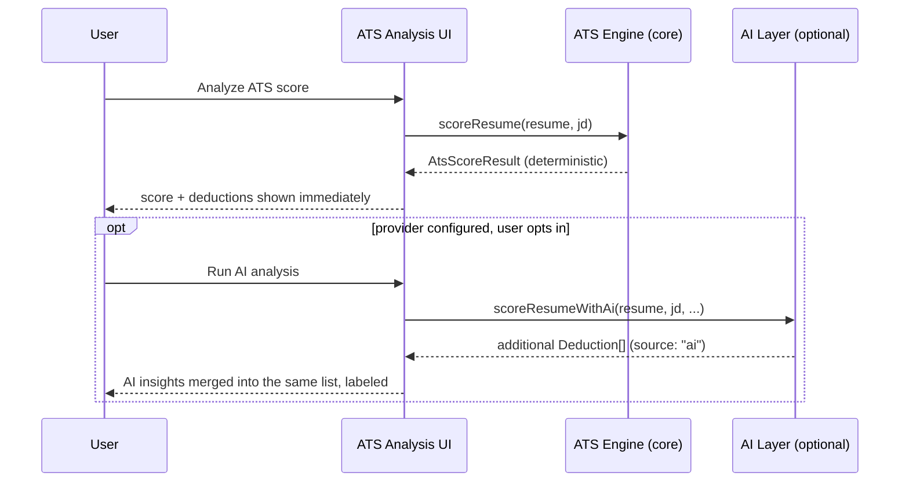

# Feature: ATS Analysis Engine

**Status:** Draft v1 · **Related:** [ADR-004](../decisions/ADR-004.md), [architecture.md §6](../architecture.md#6-ats-engine), [DEVELOPMENT_PLAN.md](../../DEVELOPMENT_PLAN.md) (deterministic engine design origin)

## Problem statement

v0.1's score is keyword-frequency matching with documented, unfixed bugs (sentence-boundary bigrams, punctuation-attached tokens failing to match, no section weighting) and no explanation beyond "here's your score." The vision calls for a redesign evaluation. Per [ADR-004](../decisions/ADR-004.md), the conclusion is: the deterministic approach itself is right (fast, free, explainable, reproducible) — it needs to be *finished*, not replaced, and extended with an optional AI layer for what rules structurally cannot evaluate.

## User stories

- As a user with no AI configured, I get a keyword-coverage score with specific, actionable reasons for every point lost.
- As a user, I see missing keywords ranked by how much the JD actually emphasizes them, not just alphabetically.
- As a user, I'm told about non-keyword problems too: no quantified impact, weak verbs, missing standard sections, formatting that ATS parsers choke on.
- As a user with a provider configured, I additionally get a semantic read on relevance and phrasing strength that the rule engine can't determine on its own.
- As a user, I never see a score presented as "you will pass/fail this company's ATS" — it's explicitly a coverage estimate.

## Functional requirements

See [requirements.md § FR-ATS](../requirements.md#ats-analysis-fr-ats-featuresats-enginemd).

## Non-functional requirements

- Pure function, deterministic layer: `score(resume, jd)` returns identical output for identical input, verified by golden-set tests (NFR-5).
- Runs in well under 1 second client-side for a typical resume/JD pair — no loading state needed for the deterministic pass.
- AI layer, when invoked, is clearly time-bounded and its absence/failure never blocks the deterministic result from displaying.

## Design: deterministic core

Carried forward from [DEVELOPMENT_PLAN.md](../../DEVELOPMENT_PLAN.md) §1, now as a v1 requirement rather than a backlog item:

1. **Sentence-aware tokenization** — split into sentences before tokenizing, so bigrams never cross sentence boundaries (fixes the `"developer. skills"` class of bug).
2. **Tech-term normalization** — `node.js`→`nodejs` internally, `k8s`→`kubernetes`, etc., against a maintained synonym map, so equivalent phrasing in JD vs. resume both match.
3. **Tech-term whitelist + JD noise filter** — a curated term set is treated as always-relevant regardless of raw frequency; a noise set (`"passionate"`, `"fast-paced"`, etc.) is filtered from keyword extraction entirely.
4. **JD section weighting** — Requirements 2.0×, Responsibilities 1.5×, Preferred 0.5×, About/Benefits 0× (excluded), unclassified 1.0×. Depends on [features/jd-parser.md](jd-parser.md)'s section detection.
5. **Keyword categorization** — language / framework / database / cloud / tool / methodology / general, used both for the score breakdown and to route keyword injection in the suggestion engine.
6. **Beyond keywords** — additional deterministic checks:
   - **Section completeness** — expected sections present (Summary/Experience/Skills/Education at minimum).
   - **Action-verb strength** — weak-verb detection (`"responsible for"`, `"worked on"`) against a verb-upgrade map.
   - **Quantified impact** — bullets with no number/metric flagged as a missed opportunity, not a hard failure (not all strong bullets are quantifiable).
   - **Formatting hazards** — structural issues most ATS parsers mishandle: tables, text-in-images, multi-column layouts, non-standard section headers, missing/inconsistent date formats.

## Design: AI layer (optional, gated on provider)

Operates on the deterministic result, not standalone — it receives the resume, JD, and the deterministic findings, and adds:

- **Relevance assessment** — does the *content* of the experience actually match the role's domain/seniority, beyond keyword overlap (e.g., "3 years of React at a startup" vs. a JD wanting "enterprise-scale React architecture experience").
- **Phrasing strength** — is a bullet's claim substantiated and specific, or vague even if it uses the right verb.
- **Consistency checks** — contradictions or implausible claims (e.g., a "5 years of Kubernetes" claim in a bullet dated before Kubernetes existed) — a real honesty backstop, not just style.

AI-layer findings are always attributed (`source: "ai"`) and additive — they never change or hide a deterministic finding, per [ADR-004](../decisions/ADR-004.md).

## API contract

```ts
interface AtsScoreResult {
  score: number;                    // 0–100
  computedAt: string;
  breakdown: CategoryScore[];
  deductions: Deduction[];          // every point lost has an entry here
  source: "deterministic" | "deterministic+ai";
}

interface CategoryScore {
  category: "language" | "framework" | "database" | "cloud" | "tool" | "methodology" | "general";
  present: Keyword[];
  missing: Keyword[];
}

interface Deduction {
  id: string;
  points: number;
  reason: string;                   // "Missing keyword: Kubernetes (appears 5x in JD Requirements)"
  recommendation: string;           // "Add Kubernetes to your Skills or a relevant experience bullet"
  category: "keyword" | "section-completeness" | "action-verb" | "impact-metric"
           | "formatting" | "relevance" | "phrasing";   // last two are AI-layer only
  source: "deterministic" | "ai";
}

function scoreResume(resume: Resume, jd: JobDescription): AtsScoreResult;              // deterministic, sync
function scoreResumeWithAi(resume: Resume, jd: JobDescription, adapter: ProviderAdapter,
                            config: ProviderConfig): Promise<AtsScoreResult>;           // extends the sync result
```

## UI flow

```
ATS Analysis screen
  ├─ Score gauge (0–100), coverage-estimate disclaimer always visible, not a tooltip
  ├─ "Why?" list — every deduction, grouped by category, each with a recommendation
  ├─ Keyword grid — present (green) / missing (red), grouped by category, sorted by weight
  ├─ Gap chart — top missing keywords ranked by weighted importance
  └─ [Run AI analysis] — only shown/enabled if a provider is configured; adds relevance/phrasing findings inline, labeled "AI insight"
```

## Sequence diagram



## Acceptance criteria

- **Given** a resume and JD with no AI provider configured, **when** the user runs analysis, **then** a score and a complete deduction list render with no network call made.
- **Given** the same resume/JD pair scored twice, **when** compared, **then** the deterministic score and deduction list are byte-identical (NFR-5).
- **Given** a missing high-frequency Requirements-section keyword, **when** viewing deductions, **then** it's ranked above a missing low-frequency Benefits-section term (which shouldn't appear as a deduction at all, since Benefits is weight 0).
- **Given** a bullet with no number and a vague verb, **when** viewing deductions, **then** both the impact-metric and action-verb deductions appear, each with a distinct recommendation.
- **Given** a resume with a table-based layout, **when** analyzed, **then** a formatting-hazard deduction appears explaining why tables are risky for ATS parsers.

## Edge cases

- JD with no detectable section headers (unstructured paste) — falls back to weight 1.0× for the whole text rather than failing to score.
- Resume with non-standard section names (e.g., "Core Competencies" instead of "Skills") — should still be detected via the pattern list in [features/resume-import.md](resume-import.md); if not recognized, the completeness deduction must say *which* expected section wasn't found, not just "incomplete."
- Very short JD (a few lines) — keyword set will be small; score should not be artificially inflated by having "matched everything" in a low-signal input. Flag low-signal JDs distinctly (e.g., "This JD may be too short for a reliable keyword analysis").
- AI layer times out or errors — deterministic result must already be displayed and remain displayed; the AI section shows its own error state, not a full-screen failure.

## Future enhancements

- Per-category mini-scores/progress bars (v0.1 F-17, planned).
- Configurable weighting (e.g., a "strict injection" mode per v0.1's feature-flag list).
- Industry-specific keyword sets beyond general tech (the current `TECH_TERMS` set is tech-role-biased — a real limitation for non-engineering resumes, worth flagging explicitly rather than silently underperforming for those users).

## Test scenarios

- Golden-set tests: fixture JD/resume pairs with hand-verified expected scores and deduction lists (regression baseline).
- Tokenizer unit tests: bigrams never cross sentence boundaries; punctuation-attached tokens still match normalized tech terms.
- Section-weighting unit tests: a keyword present only in a Benefits section contributes zero score weight.
- Formatting-hazard unit tests: fixture resumes with tables/images/multi-column layouts each trigger the expected deduction.
- AI-layer contract test: mocked `ProviderAdapter` returning a fixed relevance assessment merges correctly into `AtsScoreResult` without mutating deterministic deductions.
