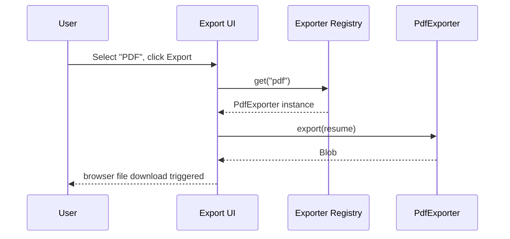

# Feature: Export Pipeline

**Status:** Draft v1 · **Related:** [architecture.md §8](../architecture.md#8-export-pipeline), [ADR-007](../decisions/ADR-007.md) (Google Docs/Gmail push dropped from v1)

## Problem statement

v0.1 export is copy-to-clipboard plus a disconnected, hardcoded `.docx` CLI script. The vision wants Markdown/PDF in v1 and an explicitly extensible pipeline for DOCX/LaTeX/templates later — the architecture needs to make "add a format" a plugin addition, not a core change.

## User stories

- As a user, I can export my working resume as a Markdown file.
- As a user, I can export my working resume as a PDF, ATS-safe (no tables/columns/images that break parsers), ready to submit.
- As a contributor, I can add a new export format (DOCX, LaTeX, a styled template) by implementing one interface, without touching the resume/suggestion/scoring code.

## Functional requirements

See [requirements.md § FR-EXP](../requirements.md#export-fr-exp-featuresexport-enginemd).

## Non-functional requirements

- Export happens entirely client-side; the file is generated and downloaded in-browser, never sent to a server (NFR-3).
- PDF export output must pass the same formatting-hazard checks the ATS engine flags on import ([features/ats-engine.md](ats-engine.md)) — the tool should not export a resume its own engine would dock points from on structure grounds.

## Design

```ts
interface Exporter {
  readonly format: string;              // "markdown" | "pdf" | future: "docx" | "latex"
  readonly displayName: string;
  export(resume: Resume): Promise<Blob>;
}
```

`MarkdownExporter` is close to trivial — it serializes `Resume.markdownSource` directly (already maintained by [features/markdown-engine.md](markdown-engine.md)).

`PdfExporter` needs a real design decision, flagged as [architecture.md open question 2](../architecture.md#13-open-questions-and-assumptions): render the resume to clean, ATS-safe HTML/CSS (single column, standard fonts, no tables) using a fixed template, then convert to PDF client-side. Two candidate approaches to spike before committing:

1. **Browser print-to-PDF** — render to a hidden iframe styled for print, invoke `window.print()`/`printToPDF`-equivalent. Zero added dependency weight, but less control over exact output and inconsistent across browsers.
2. **A PDF-generation library** (e.g., `pdf-lib`, `react-pdf`) — more control and consistency, adds bundle size.

Both are plugins behind the same `Exporter` interface — the choice affects `PdfExporter`'s internals only, not the contract other code depends on.

Exporters are registered at app startup in a registry (`core/export/registry.ts`), and the Export UI enumerates whatever's registered — so adding `DocxExporter` later means one new file plus one registry line, not a UI rewrite.

## UI flow

```
Export
  ├─ Format list (from Exporter registry): Markdown, PDF
  ├─ [Export] → export(resume) → Blob → browser download
  └─ (PDF) live preview of the exact rendered output before download, since PDF is a one-way transform users should be able to check first
```

## Sequence diagram



## Acceptance criteria

- **Given** a working resume, **when** exported to Markdown, **then** the downloaded file is byte-identical to `Resume.markdownSource`.
- **Given** a working resume, **when** exported to PDF, **then** the output uses a single-column, standard-heading, ATS-safe layout with no tables or embedded images of text.
- **Given** the Export screen, **when** opened, **then** only formats with a registered `Exporter` are listed — no dead/disabled options for unimplemented formats.

## Edge cases

- Resume with unusually long content (multi-page) — PDF export must paginate correctly, not truncate or overlap content.
- Resume with special characters/unicode (accented names, non-Latin scripts in contact info) — must render correctly in both Markdown and PDF output.
- Export attempted with an empty/near-empty resume — should succeed (produces a minimal valid file) rather than erroring, since the user may legitimately want to check formatting early.

## Future enhancements

- DOCX export (replacing the disconnected `build_resume.js` script with a proper `DocxExporter`, generalized beyond one hardcoded resume — FR-EXP-4).
- LaTeX export.
- Multiple visual templates (modern vs. traditional-ATS-safe) selectable at export time.
- JSON export (the raw `Resume` object) for interop with other tools.

## Test scenarios

- Snapshot tests: fixture `Resume` objects produce stable Markdown output byte-for-byte across runs.
- PDF formatting-hazard test: generated PDF's underlying HTML/structure passes the same hazard checks the ATS engine uses to flag imported resumes (i.e., the exporter doesn't produce what the scorer would penalize).
- Registry test: registering a mock `Exporter` makes it appear in the Export UI's format list with no other code changes.
