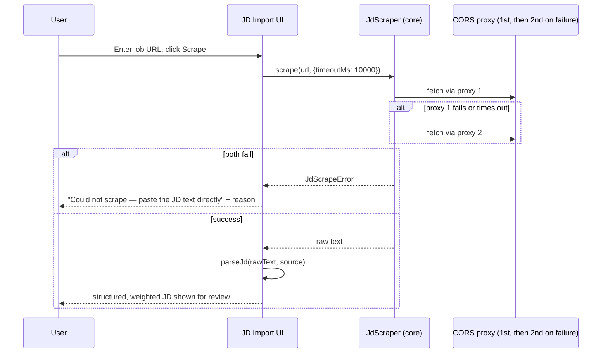

# Feature: Job Description Import & Parsing

**Status:** Draft v1 · **Related:** [architecture.md §3.2](../architecture.md#32-jd-json), [DEVELOPMENT_PLAN.md](../../DEVELOPMENT_PLAN.md) §1.2 and §3 (section weighting and scraping design origin)

## Problem statement

The ATS engine's accuracy depends entirely on clean, section-aware JD input. v0.1 already has a working paste path and a partially-working scrape path (single CORS proxy, no timeout, no section weighting) — this feature finishes that work rather than starting over.

## User stories

- As a user, I can paste JD text directly.
- As a user, I can give a URL and have the posting scraped automatically for supported job boards.
- As a user, when scraping fails (LinkedIn, Glassdoor, Workday, or any blocked site), I get a clear, immediate message telling me to paste instead — not a hang or a silent empty result.
- As a user, the JD is automatically cleaned of navigation/boilerplate/benefits noise before scoring.
- As a user, I can see and edit the cleaned/structured JD before analysis.

## Functional requirements

See [requirements.md § FR-JD](../requirements.md#jd-import-fr-jd-featuresjd-parsermd).

## Non-functional requirements

- Scrape requests are timeout-bounded (documented v0.1 bug: no timeout today) (NFR-8).
- Scraping never blocks the paste path — paste must work even if scraping is fully unavailable (e.g., proxy down).

## Design

Carries forward the already-designed but unimplemented v0.1 plan:

- **Two-proxy fallback** ([DEVELOPMENT_PLAN.md](../../DEVELOPMENT_PLAN.md) §3.1) with a bounded timeout per attempt.
- **Selector priority list** per job board ATS system (Greenhouse, Lever, Indeed, Workday, Ashby, BambooHR), falling back to generic `article`/`main`/`[class*="job-description"]` selectors.
- **Post-extraction cleanup** — strip salary/compensation boilerplate, "Apply now" CTAs, excess whitespace.
- **Section parsing + weighting** — same `SECTION_WEIGHTS` classification used by the ATS engine ([features/ats-engine.md](ats-engine.md)): Requirements 2.0×, Responsibilities 1.5×, Preferred 0.5×, About/Benefits 0×.
- **Language detection** on the cleaned text (Step 1 of the vision explicitly calls for this) — a lightweight client-side detector; full multi-language *optimization* support is out of scope (see [architecture.md open question 6](../architecture.md#13-open-questions-and-assumptions)), but detecting and storing the language is in scope so the UI can at least flag when heuristics tuned for English may be unreliable.

## API contract

```ts
interface JdScraper {
  scrape(url: string, opts?: { timeoutMs?: number }): Promise<string>;  // raw HTML/text, throws JdScrapeError
}

type JdScrapeError =
  | { kind: "blocked"; message: string }      // known-blocked host (LinkedIn, Glassdoor, Workday)
  | { kind: "timeout"; message: string }
  | { kind: "empty_result"; message: string }
  | { kind: "network"; message: string };

function parseJd(rawText: string, source: JobDescription["source"]): JobDescription;  // architecture.md §3.2, sync, deterministic
```

## UI flow

```
Import Job Description
  ├─ [Paste text] textarea, OR
  ├─ [URL] field → [Scrape] → on JdScrapeError.kind === "blocked"|"timeout"|"empty_result":
  │     inline message + "paste instead" call to action, never a bare failure
  ├─ Cleaned/structured JD shown: detected sections, language, company/role if detected
  └─ User can edit the cleaned text directly before proceeding
```

## Sequence diagram



## Acceptance criteria

- **Given** a Greenhouse/Lever/Ashby/BambooHR URL, **when** scraped, **then** the extracted text matches the visible job posting content with navigation/footer excluded.
- **Given** a LinkedIn or Glassdoor URL, **when** scraped, **then** the failure is reported as `blocked` immediately (well within the timeout), with a paste-instead prompt — not a long hang before failing.
- **Given** a scrape that exceeds the timeout, **when** it fails, **then** the second proxy is attempted before surfacing an error to the user.
- **Given** any successfully scraped or pasted JD, **when** parsed, **then** Benefits/Perks/About-us content is weighted 0 and excluded from keyword scoring, while Requirements content is weighted highest.

## Edge cases

- JD text with no detectable section headers (plain unstructured paste) — whole text treated as weight 1.0, not dropped or mis-weighted to 0.
- Company careers page with a non-standard DOM (v0.1's "⚠ varies by site" case) — generic selector fallback applies; if extraction still returns near-empty content (`empty_result`), user is prompted to paste rather than being shown a near-blank JD silently.
- Non-English JD — language is detected and stored; UI should note that section-weighting heuristics are English-pattern-tuned and may be less reliable, rather than presenting the same confidence level regardless of language.
- Proxy returns a 200 with a captcha/interstitial page instead of the real content — the empty/short-content heuristic already in v0.1 (`data.contents.length < 200`) should be carried forward as a first-pass guard, understanding it's imperfect.

## Future enhancements

- Direct API integrations for major ATS platforms (Greenhouse/Lever both expose public job-posting APIs in some configurations) instead of HTML scraping, where available — more reliable than selector-based scraping.
- Browser extension for one-click JD import (listed as a future idea in [ROADMAP.md](../../ROADMAP.md)), which would sidestep the CORS-proxy dependency entirely by reading the page the user is already on.

## Test scenarios

- Fixture-based scraper tests against saved HTML snapshots for each supported job board (Greenhouse, Lever, Indeed, Ashby, BambooHR) — same fixture set named in v0.1's `DEVELOPMENT_PLAN.md` §4 test suite plan.
- Timeout/fallback test: first proxy simulated as hung, confirms second proxy is attempted within the overall timeout budget.
- Section-weighting unit tests: a fixture JD with clearly labeled Requirements/Preferred/Benefits sections produces the expected per-section weights.
- Blocked-host test: LinkedIn/Glassdoor/Workday URLs short-circuit to `blocked` without attempting a full scrape cycle, keeping failure fast.

