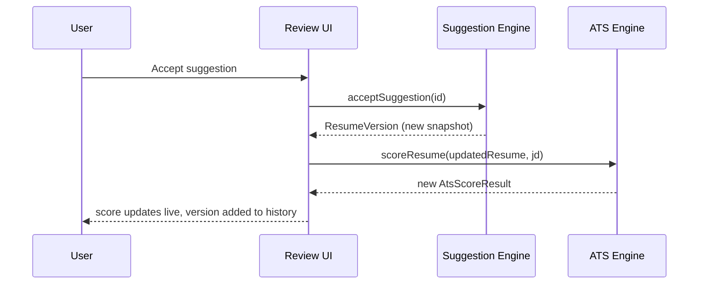

# Feature: Interactive Suggestion Review & Resume Editor

**Status:** Draft v1 · **Related:** [architecture.md §3.3](../architecture.md#33-suggestion-and-audit-trail), [ADR-004](../decisions/ADR-004.md) (hybrid engine — this feature is the primary consumer of both deterministic and AI-sourced suggestions)

## Problem statement

The vision explicitly rejects auto-apply: every AI-originated change must be a reviewable proposal (original → suggested → reason), individually accepted or rejected, never silently applied. This is also where the "never fabricate experience" principle is enforced at the UX layer, not just the prompt layer.

## User stories

- As a user, I see every proposed change as original → suggested → reason before it touches my resume.
- As a user, I can accept or reject each suggestion independently — accepting one doesn't bulk-apply others.
- As a user, I can ask for a suggestion to be regenerated, shortened, expanded, made more professional, made more ATS-focused, or made more human-sounding.
- As a user, rejecting a suggestion is a real signal, not a no-op — it's recorded.
- As a user, I can freely hand-edit the resume at any point, independent of the suggestion flow.

## Functional requirements

See [requirements.md § FR-OPT](../requirements.md#ai-optimization--interactive-review-fr-opt-featuresresume-editormd).

## Non-functional requirements

- Accepting/rejecting a suggestion is a synchronous, local state update (no network round-trip) — it operates on already-generated `Suggestion` records.
- Every accepted suggestion or manual edit produces a `ResumeVersion` (architecture.md §3.4) — history is append-only, never overwritten.

## Design

Suggestions come from two sources, always distinguishable in the UI:

- **Deterministic suggestions** (`source: "deterministic"`) — e.g., skills-section keyword injection, verb-upgrade substitutions. These are lower-risk (grammatically safe by construction, per the injection-routing rules in [features/ats-engine.md](ats-engine.md)) and may be presented with a lighter-weight accept flow (e.g., bulk-acceptable as a group), but are still never auto-applied without being shown.
- **AI suggestions** (`source: "ai"`) — bullet rewrites, phrasing improvements. Always require individual review; never bulk-acceptable, since each depends on judgment about naturalness and honesty that a human must apply per-bullet.

Refinement actions (shorten / expand / more professional / ATS-focused / human-sounding / explain reasoning / rewrite again) are modeled as a new `CompletionRequest` derived from the original suggestion plus a style directive — they produce a *new* `Suggestion` record referencing the same `resumeEntryId`, they don't mutate the existing one, preserving the audit trail.

## API contract

```ts
type RefinementAction = "regenerate" | "shorten" | "expand"
  | "more_professional" | "more_ats_focused" | "more_human" | "explain_reasoning";

function acceptSuggestion(suggestionId: string): ResumeVersion;   // mutates working Resume JSON, appends version
function rejectSuggestion(suggestionId: string): void;             // records rejection, no resume mutation
function refineSuggestion(suggestionId: string, action: RefinementAction): Promise<Suggestion>;  // AI-only; new Suggestion record
```

The honesty constraint (FR-OPT-5) is enforced at the prompt-construction layer in `core/suggestions/` — the system prompt sent to any `ProviderAdapter` explicitly constrains the model to the resume's existing content and forbids introducing unlisted skills/tools/claims, and generated suggestions are checked against the source resume's existing terms before being surfaced (a keyword introduced in a suggestion that appears nowhere in the original resume or JD context is flagged for extra scrutiny in the UI, not silently trusted).

## UI flow

```
Suggestion Review
  ├─ List of pending Suggestions, grouped by resume section
  ├─ Each: [Original] vs [Suggested], Reason, source badge (Rule-based | AI)
  │     Actions: [Accept] [Reject] [Regenerate] [Shorten] [Expand] [More professional]
  │              [More ATS-focused] [More human] [Explain reasoning]
  └─ Accepting → live ATS re-score triggers (features/ats-engine.md), version snapshot recorded
```

## Sequence diagram



## Acceptance criteria

- **Given** a pending AI suggestion, **when** the user clicks Accept, **then** the working Resume JSON updates, a new `ResumeVersion` is created, and the score re-computes automatically.
- **Given** a pending suggestion, **when** the user clicks Reject, **then** the resume is unchanged and the rejection is recorded with a timestamp.
- **Given** an accepted suggestion, **when** viewing version history, **then** the prior version remains fully viewable and restorable.
- **Given** a suggestion introduces a keyword absent from the original resume, **when** displayed, **then** the UI visibly flags it for extra scrutiny rather than presenting it identically to a substantiated rewrite.

## Edge cases

- Two pending suggestions target the same bullet (e.g., a deterministic verb-upgrade and an AI rewrite) — accepting one should invalidate/re-evaluate the other rather than silently applying both and producing garbled text.
- User manually edits a bullet that has a pending suggestion attached — the pending suggestion's `original` no longer matches current resume text; it must be invalidated (re-diffed or dropped) rather than applied against stale text.
- Rapid accept/reject clicking — state transitions must be idempotent (double-accept is a no-op, not a double-applied change).

## Future enhancements

- Bulk-accept for a whole category of deterministic suggestions (e.g., "accept all skills-section additions") with a single confirmation.
- Suggestion confidence scores surfaced in the UI, not just accept/reject.
- "Don't suggest this again" learning from rejection patterns within a session.

## Test scenarios

- State-machine tests: accept/reject/refine transitions on `Suggestion.status`, including the stale-suggestion-invalidation edge case above.
- Prompt-construction tests: verify the system prompt sent for any refinement action includes the honesty constraint and the resume's actual content as the only source of truth.
- Integration test: accepting a suggestion triggers exactly one re-score, not zero or multiple.
