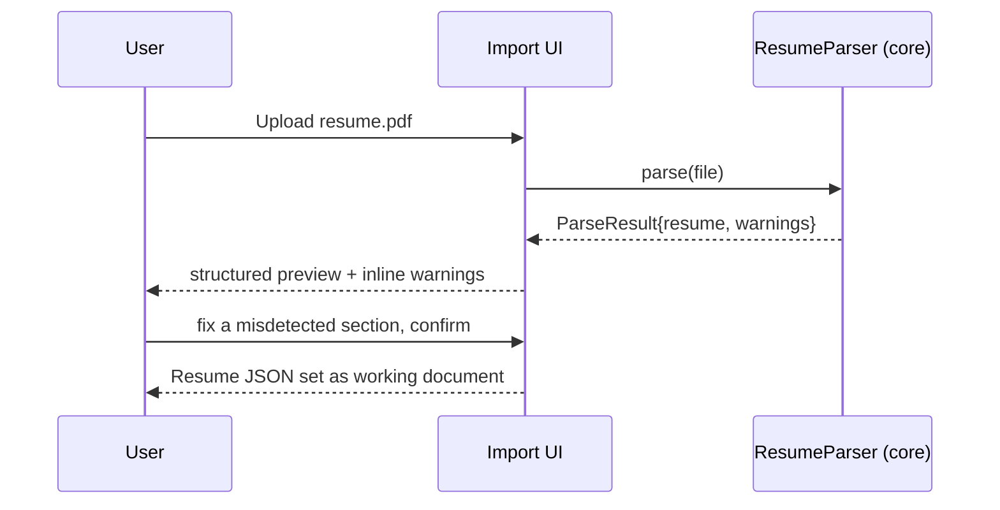

# Feature: Resume Import

**Status:** Draft v1 · **Related:** [architecture.md §3.1](../architecture.md#31-resume-json), [architecture.md open question 1](../architecture.md#13-open-questions-and-assumptions)

## Problem statement

v0.1 accepts pasted plain text only. Every downstream feature (scoring, suggestions, markdown source, export) depends on a reliable, structured Resume JSON — so import quality is a foundation-level concern, not a convenience feature.

## User stories

- As a user, I can upload a PDF resume and get it parsed into sections without retyping anything.
- As a user, I can upload or paste Markdown and have it treated as the canonical source directly.
- As a user, I can paste plain text as before, with no regression from v0.1.
- As a user, whatever gets extracted is shown to me before it's used for anything else, so I can fix any misparse immediately rather than get a silently wrong score later.

## Functional requirements

See [requirements.md § FR-RES](../requirements.md#resume-import-fr-res-featuresresume-importmd).

## Non-functional requirements

- Parsing happens entirely client-side — the PDF/text content is never uploaded anywhere (NFR-3).
- Import of a typical (1-3 page) resume completes in well under 5 seconds on typical hardware.

## Design

Three input paths converge on one normalization step:

```
PDF   → pdf.js text+layout extraction → heading/section heuristics → Resume JSON
MD    → markdown parse → Resume JSON (near-lossless, MD is already the canonical shape)
Text  → same section-header heuristics as v0.1 (regex against SECTION_PATTERNS) → Resume JSON
```

Section-header detection reuses the pattern approach already validated in v0.1's `DEVELOPMENT_PLAN.md` §2.1 (`summary|objective|about`, `skills|technologies|competencies`, `experience|employment|career`, `projects|portfolio`, `education|academic|degree`), extended with `certifications` and `achievements` per the vision's target section list.

PDF extraction quality (multi-column layouts, tables, text-in-image resumes) is a known risk — see [architecture.md § Risk analysis](../architecture.md#12-risk-analysis-and-trade-offs) and open question 1. The library choice (`pdf.js` is the leading candidate) needs a short spike against real-world resume templates before being finalized.

## API contract

```ts
interface ResumeParser {
  readonly acceptedTypes: string[];        // MIME types or extensions this parser handles
  parse(input: File | string): Promise<ParseResult>;
}

interface ParseResult {
  resume: Resume;                           // architecture.md §3.1
  warnings: ParseWarning[];                  // never thrown away — always shown to the user
}

interface ParseWarning {
  severity: "info" | "warning";
  message: string;                           // "Could not confidently detect a Skills section"
  affectedSectionId?: string;
}
```

`ResumeParser` implementations for PDF, Markdown, and plain text are registered the same way `Exporter`s are ([features/export-engine.md](export-engine.md)) — new formats (DOCX) are additive.

## UI flow

```
Import Resume
  ├─ Tabs: [Upload PDF] [Upload/Paste Markdown] [Paste Text]
  ├─ On parse: structured preview shown (sections, entries, bullets) with any ParseWarnings surfaced inline
  ├─ User edits/confirms the structure directly (not just the raw text) before proceeding
  └─ [Continue] → Resume JSON becomes the working document
```

## Sequence diagram



## Acceptance criteria

- **Given** a well-formatted single-column PDF resume, **when** uploaded, **then** all standard sections (Summary/Experience/Education/Skills) are correctly detected with no warnings.
- **Given** a Markdown file, **when** uploaded, **then** the resulting Resume JSON round-trips back to equivalent Markdown with no content loss.
- **Given** a PDF with a two-column layout, **when** uploaded, **then** a `ParseWarning` is shown rather than silently interleaved/scrambled text.
- **Given** any import path, **when** parsing completes, **then** the user sees the structured result before it affects any score or suggestion.

## Edge cases

- Scanned/image-based PDF with no extractable text layer — must be detected and reported as unsupported, not silently return an empty resume.
- Resume with no detectable section headers at all — entire content falls into an "Other/Uncategorized" section rather than being dropped.
- Extremely long resume (multi-page CV) — parsing must not block the UI thread; consider a web worker if PDF parsing proves slow in the library spike.
- Resume text containing content that looks like a section header but isn't (e.g., a bullet mentioning "Skills:" mid-sentence) — heuristics will misfire sometimes; this is exactly why FR-RES-4 (always show for confirmation) is non-negotiable rather than a nice-to-have.

## Future enhancements

- DOCX upload (FR-RES-6).
- LinkedIn "Export to PDF" format-specific tuning, since it's a common source resume format.
- OCR fallback for scanned/image PDFs.

## Test scenarios

- Fixture-based parser tests: a small library of real-world-shaped resume PDFs/Markdown/text (single-column, two-column, table-based, non-standard headers) with expected `ParseResult` snapshots.
- Warning-emission tests: each known failure mode (image-only PDF, undetected section) produces the correct `ParseWarning`.
- Round-trip test: Resume JSON → Markdown → re-parsed Resume JSON is structurally equivalent (supports [features/markdown-engine.md](markdown-engine.md)'s sync requirement).
